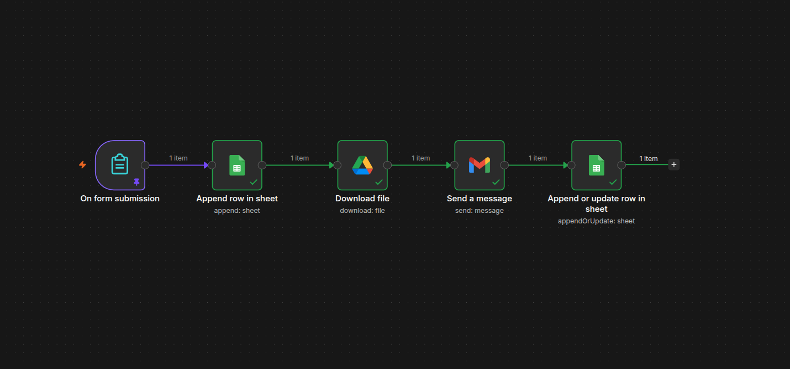
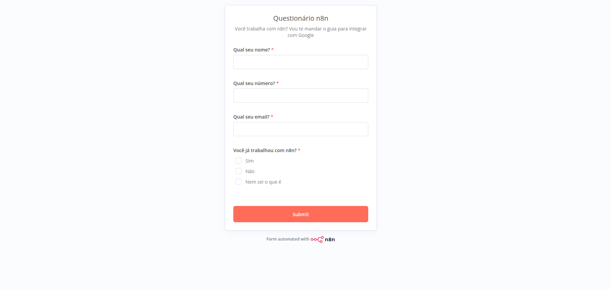
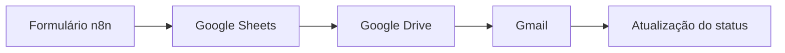

# Automação de Envio de Documentos com n8n

Automação desenvolvida com **n8n** para coletar informações por meio de um formulário, registrar os dados no Google Sheets, baixar automaticamente um documento do Google Drive, enviá-lo por e-mail e atualizar o status do processamento.

## Visão geral

O projeto automatiza um processo que normalmente exigiria várias ações manuais:

1. Receber as informações do usuário;
2. Registrar os dados em uma planilha;
3. Localizar e baixar um documento;
4. Enviar o documento por e-mail;
5. Atualizar a planilha com o resultado do envio.

## Workflow



## Formulário

O processo começa com um formulário criado diretamente no n8n.



As seguintes informações são solicitadas:

- Nome;
- Número de contato;
- E-mail;
- Experiência anterior com o n8n.

## Funcionamento



### 1. Recebimento do formulário

O gatilho **On Form Submission** inicia o workflow quando um usuário envia uma resposta pelo formulário.

### 2. Registro no Google Sheets

O node **Append Row in Sheet** registra as informações recebidas em uma planilha do Google Sheets.

Exemplo da estrutura:

| Nome | E-mail | Experiência com n8n | Data | Status |
|---|---|---|---|---|
| Usuário de exemplo | usuario@exemplo.com | Sim | 14/09/2026 | SENT |

### 3. Download do documento

O node **Download File** acessa o Google Drive e baixa o documento que será enviado ao usuário.

O arquivo fica disponível como dado binário para a próxima etapa do workflow.

### 4. Envio por e-mail

O node **Send a Message** utiliza o Gmail para enviar:

- Assunto personalizado;
- Mensagem formatada em HTML;
- Documento anexado;
- Destinatário obtido pelo formulário.

### 5. Atualização do status

Depois que o e-mail é enviado, o node **Append or Update Row in Sheet** atualiza o registro correspondente na planilha.

O campo de status recebe o valor:

```text
SENT
```

Isso permite identificar que o documento foi enviado com sucesso.

## Tecnologias utilizadas

- [n8n](https://n8n.io/)
- Google Forms do n8n
- Google Sheets
- Google Drive
- Gmail
- OAuth 2.0
- HTML

## Estrutura do projeto

```text
automacao-envio-documentos-n8n/
├── workflow/
│   └── workflow.json
├── images/
│   ├── formulario.png
│   └── workflow-completo.png
├── README.md
├── .gitignore
└── LICENSE
```

## Como utilizar

### Pré-requisitos

Antes de importar o projeto, você precisará de:

- Uma instalação ou conta no n8n;
- Uma conta Google;
- Um projeto configurado no Google Cloud;
- Credenciais OAuth 2.0;
- Uma planilha no Google Sheets;
- Um documento armazenado no Google Drive.

### Importação do workflow

1. Faça o download do arquivo `workflow/workflow.json`;
2. Acesse sua conta no n8n;
3. Crie um novo workflow;
4. Selecione a opção **Import from File**;
5. Escolha o arquivo JSON;
6. Configure suas próprias credenciais;
7. Selecione sua planilha e seu documento;
8. Execute um teste;
9. Ative o workflow.

## Configuração das credenciais

O workflow utiliza três integrações do Google:

| Serviço | Finalidade |
|---|---|
| Google Sheets | Registrar os dados e atualizar o status |
| Google Drive | Baixar o documento |
| Gmail | Enviar o e-mail com o anexo |

As credenciais não são distribuídas com o projeto. Cada pessoa deve configurar sua própria autenticação OAuth 2.0 no n8n.

## Segurança e privacidade

Este repositório não deve armazenar:

- Client ID e Client Secret;
- Tokens de acesso;
- Senhas;
- Credenciais do n8n;
- Dados pessoais reais;
- IDs privados de documentos e planilhas;
- Resultados reais de execuções.

Os dados presentes na documentação são apenas exemplos.

## Possíveis melhorias

- Validação de e-mail e telefone;
- Tratamento automático de falhas;
- Registro do status `ERROR` em caso de erro;
- Tentativas automáticas de reenvio;
- E-mail personalizado com o nome do usuário;
- Envio de documentos diferentes conforme a resposta;
- Notificação para o administrador;
- Dashboard para acompanhar os envios;
- Integração com banco de dados ou API própria.

## Aprendizados

Durante o desenvolvimento deste projeto, foram aplicados conceitos de:

- Automação de processos;
- Integração entre serviços;
- Autenticação OAuth 2.0;
- Manipulação de dados JSON;
- Expressões do n8n;
- Processamento de arquivos binários;
- Envio de e-mails com anexos;
- Atualização de registros no Google Sheets;
- Controle de status do processamento.

## Autor

**Henry Gabriel Santos Silva**

Estudante de Engenharia da Computação e desenvolvedor com foco em Engenharia de Dados, automação de processos e integração de sistemas.

[LinkedIn](https://www.linkedin.com/in/henry-gabriel-santos-silva-6ba776209/)

## Licença

Este projeto está disponível sob a licença MIT.