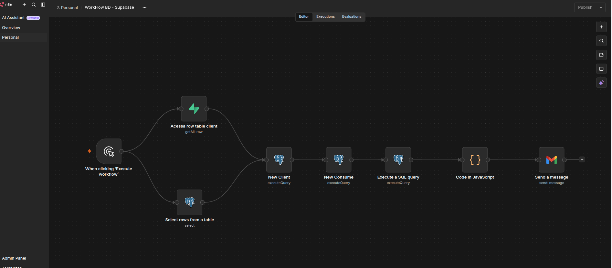
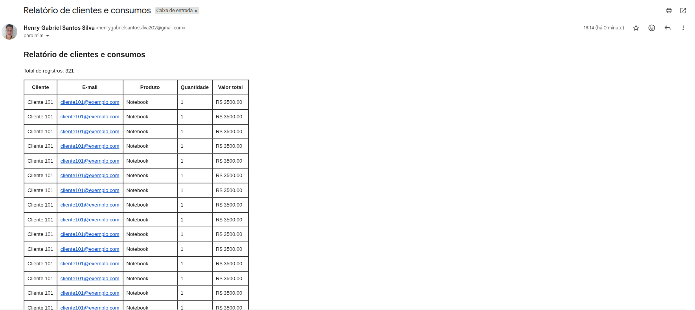
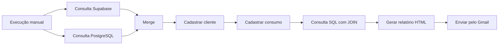

# Automação de Clientes e Consumos com n8n

Automação desenvolvida com **n8n** para consultar dados no Supabase e PostgreSQL, cadastrar clientes e consumos, relacionar as informações das tabelas e enviar automaticamente um relatório em HTML por e-mail.

## Visão geral

O projeto automatiza as seguintes atividades:

1. Consultar clientes no Supabase;
2. Consultar registros no PostgreSQL;
3. Sincronizar as duas consultas;
4. Cadastrar ou atualizar clientes;
5. Registrar consumos;
6. Relacionar clientes e consumos;
7. Criar um relatório em HTML;
8. Enviar o resultado pelo Gmail.

## Resultado do projeto

Ao final da execução, o workflow envia um único e-mail contendo:

- Total de registros encontrados;
- Nome do cliente;
- E-mail;
- Produto;
- Quantidade;
- Valor total.

## Workflow completo

A imagem abaixo apresenta todos os nodes utilizados na automação:



## Relatório enviado por e-mail

O resultado da consulta é transformado em uma tabela HTML e enviado automaticamente pelo Gmail:



## Arquitetura



## Funcionamento

### 1. Início do workflow

O gatilho **When Clicking Execute Workflow** inicia manualmente a automação.

O gatilho manual foi escolhido porque o projeto possui finalidade de estudo e demonstração.

### 2. Consulta de clientes no Supabase

O node do Supabase consulta os clientes cadastrados na tabela.

Entre os dados recuperados estão:

- Identificador;
- Nome;
- E-mail;
- Telefone;
- Cidade;
- Estado;
- Status;
- Origem;
- Data de criação;
- Retorno financeiro.

### 3. Consulta no PostgreSQL

Paralelamente, um node PostgreSQL consulta os registros necessários para o processamento.

Essa etapa demonstra como o n8n pode acessar diretamente um banco PostgreSQL.

### 4. Sincronização com Merge

As duas consultas são encaminhadas para um node **Merge**.

Configuração utilizada:

```text
Mode: Choose Branch
Number of Inputs: 2
Output Type: Wait for All Inputs to Arrive
Output: Data of Specified Input
Use Data of Input: 1
```

O Merge aguarda as duas consultas terminarem e libera somente uma execução para o restante do workflow.

Sem essa sincronização, cada entrada executava o restante do fluxo separadamente, resultando no envio de dois e-mails.

### 5. Cadastro do cliente

O node **New Client** executa uma consulta SQL para cadastrar ou atualizar o cliente.

Exemplo de `UPSERT`:

```sql
INSERT INTO public.clientes (
    nome,
    email,
    telefone,
    cidade,
    estado
)
VALUES (
    $1,
    $2,
    $3,
    $4,
    $5
)
ON CONFLICT (email)
DO UPDATE SET
    nome = EXCLUDED.nome,
    telefone = EXCLUDED.telefone,
    cidade = EXCLUDED.cidade,
    estado = EXCLUDED.estado
RETURNING *;
```

### 6. Cadastro do consumo

O node **New Consume** registra um consumo relacionado ao cliente.

```sql
INSERT INTO public.consumos_clientes (
    cliente_id,
    produto,
    quantidade,
    valor_unitario,
    valor_total,
    data_consumo
)
VALUES (
    $1,
    $2,
    $3,
    $4,
    $5,
    NOW()
)
RETURNING *;
```

O campo `cliente_id` representa a chave estrangeira que relaciona o consumo ao cliente.

### 7. Relacionamento entre clientes e consumos

O node PostgreSQL executa um `JOIN` entre as duas tabelas:

```sql
SELECT
    c.id AS cliente_id,
    c.nome,
    c.email,
    c.cidade,
    c.estado,
    co.produto,
    co.quantidade,
    co.valor_unitario,
    co.valor_total,
    co.data_consumo
FROM public.clientes AS c
INNER JOIN public.consumos_clientes AS co
    ON co.cliente_id = c.id
ORDER BY co.data_consumo DESC;
```

O Merge e o `JOIN` possuem funções diferentes:

| Recurso | Responsabilidade |
|---|---|
| Merge | Sincronizar as ramificações do workflow |
| SQL JOIN | Relacionar os registros das tabelas |

### 8. Geração do relatório HTML

O node **Code in JavaScript** recebe todos os resultados da consulta.

Ele deve estar configurado como:

```text
Run Once for All Items
```

Código utilizado:

```javascript
const registros = $input.all().map(item => item.json);

const formatarMoeda = (valor) => {
  if (valor === null || valor === undefined) {
    return '—';
  }

  return Number(valor).toLocaleString('pt-BR', {
    style: 'currency',
    currency: 'BRL',
  });
};

const linhas = registros.map(registro => `
  <tr>
    <td>${registro.nome ?? '—'}</td>
    <td>${registro.email ?? '—'}</td>
    <td>${registro.produto ?? '—'}</td>
    <td style="text-align: center;">
      ${registro.quantidade ?? '—'}
    </td>
    <td>${formatarMoeda(registro.valor_total)}</td>
  </tr>
`).join('');

const mensagem = `
  <div style="font-family: Arial, sans-serif; color: #222;">
    <h2>Relatório de clientes e consumos</h2>

    <p>
      Total de registros:
      <strong>${registros.length}</strong>
    </p>

    <table
      border="1"
      cellpadding="8"
      style="border-collapse: collapse; width: 100%;"
    >
      <thead>
        <tr style="background-color: #f2f2f2;">
          <th>Cliente</th>
          <th>E-mail</th>
          <th>Produto</th>
          <th>Quantidade</th>
          <th>Valor total</th>
        </tr>
      </thead>

      <tbody>
        ${linhas}
      </tbody>
    </table>

    <p style="margin-top: 20px; color: #666; font-size: 12px;">
      Relatório gerado automaticamente pelo n8n.
    </p>
  </div>
`;

return [{
  json: {
    assunto: 'Relatório de clientes e consumos',
    mensagem,
  },
}];
```

Esse código transforma todos os registros em um único item, evitando o envio de um e-mail para cada linha.

### 9. Envio pelo Gmail

O node **Send a Message** utiliza as seguintes configurações:

```text
Operation: Send
Email Type: HTML
Subject: {{ $json.assunto }}
Message: {{ $json.mensagem }}
```

As expressões precisam utilizar duas chaves. A sintaxe incorreta faz com que a expressão seja enviada como texto.

## Tecnologias utilizadas

- [n8n](https://n8n.io/)
- [Supabase](https://supabase.com/)
- PostgreSQL
- Gmail
- OAuth 2.0
- SQL
- JavaScript
- JSON
- HTML

## Estrutura do projeto

```text
Projeto_001/
├── workflow/
│   └── workflow.json
├── sql/
│   └── relatorio-clientes-consumos.sql
├── code/
│   └── formatar-email.js
├── images/
│   ├── workflow_completo.png
│   └── relatorio_email.png
└── README.md
```

## Como utilizar

### Pré-requisitos

Antes de importar o workflow, você precisará de:

- Uma instalação ou conta no n8n;
- Um projeto no Supabase;
- Um banco PostgreSQL;
- As tabelas `clientes` e `consumos_clientes`;
- Credenciais de acesso ao banco;
- Uma conta Google;
- Credenciais OAuth 2.0 para o Gmail.

### Importação

1. Faça o download de `workflow/workflow.json`;
2. Acesse sua conta no n8n;
3. Crie um novo workflow;
4. Selecione **Import from File**;
5. Escolha o arquivo JSON;
6. Configure as credenciais do Supabase;
7. Configure as credenciais do PostgreSQL;
8. Configure a credencial do Gmail;
9. Revise os nomes das tabelas e colunas;
10. Execute o workflow completo;
11. Confirme que somente um e-mail foi enviado.

## Configuração das integrações

| Serviço | Finalidade |
|---|---|
| Supabase | Consultar os clientes |
| PostgreSQL | Cadastrar, consultar e relacionar os dados |
| Gmail | Enviar o relatório em HTML |

As credenciais não são distribuídas com o projeto. Cada usuário deve configurar seus próprios acessos após importar o workflow.

## Problemas solucionados

### Envio de dois e-mails

As consultas do Supabase e PostgreSQL estavam inicialmente conectadas diretamente ao mesmo node.

Cada entrada executava o restante do workflow separadamente, provocando o envio de dois e-mails.

A solução foi adicionar o node **Merge** para aguardar as duas consultas.

### Campos de consumo vazios

A consulta inicial retornava apenas os clientes. Por isso, os campos de produto, quantidade e valor ficavam vazios.

A solução foi executar um `JOIN` entre `clientes` e `consumos_clientes`.

### Expressões enviadas como texto

A expressão foi inicialmente configurada com colchetes:

```text
{[$json.assunto]}
```

A sintaxe correta é:

```text
{{ $json.assunto }}
```

### Registros duplicados

Durante os testes, algumas execuções cadastraram repetidamente o mesmo consumo.

Esse comportamento demonstra a importância da idempotência e de restrições únicas no banco.

## Segurança e privacidade

Este repositório não deve armazenar:

- Senhas;
- Tokens de acesso;
- Chaves privadas;
- URL privada do banco;
- Client ID e Client Secret;
- Credenciais do Supabase;
- Credenciais do PostgreSQL;
- Credenciais do Gmail;
- E-mails ou telefones reais;
- Dados pessoais reais;
- Dados de produção;
- Informações fixadas de execuções.

Os registros apresentados são fictícios e utilizados somente para estudos.

## Possíveis melhorias

- Implementar idempotência;
- Criar chaves únicas para os consumos;
- Utilizar `UPSERT`;
- Evitar registros duplicados;
- Adicionar filtros por período;
- Gerar relatórios em CSV ou Excel;
- Anexar o relatório ao e-mail;
- Calcular o total consumido por cliente;
- Adicionar tratamento de erros;
- Implementar tentativas de reprocessamento;
- Enviar alertas em caso de falha;
- Substituir o gatilho manual por agendamento;
- Criar um dashboard para acompanhamento.

## Aprendizados

Durante o desenvolvimento deste projeto, foram aplicados conceitos de:

- Automação de processos;
- Integração com Supabase;
- Integração com PostgreSQL;
- Modelagem relacional;
- Chaves primárias e estrangeiras;
- Consultas com `JOIN`;
- Sincronização com Merge;
- Manipulação de múltiplos itens;
- JavaScript no n8n;
- Geração de HTML;
- Expressões do n8n;
- OAuth 2.0;
- Envio automático de e-mails;
- Diagnóstico de execuções duplicadas.

## Autor

**Henry Gabriel Santos Silva**

Estudante de Engenharia da Computação e desenvolvedor com foco em Engenharia de Dados, automação de processos e integração de sistemas.

- [LinkedIn](https://www.linkedin.com/in/henry-gabriel-santos-silva-6ba776209/)
- [GitHub](https://github.com/Henry-Gbriel)

## Licença

Este projeto está disponível sob a licença MIT.