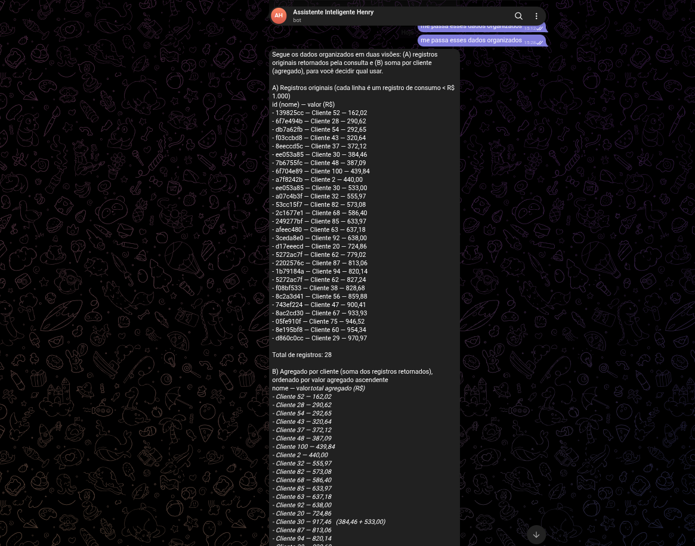
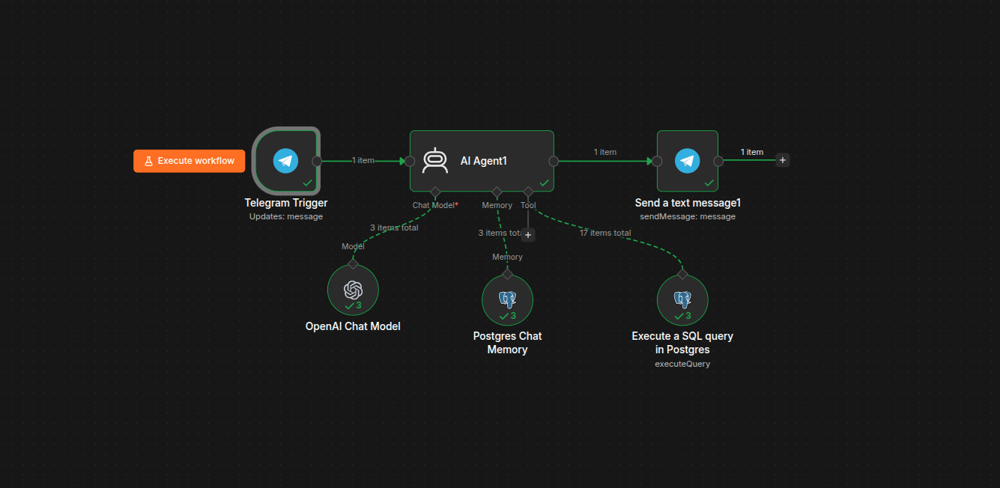
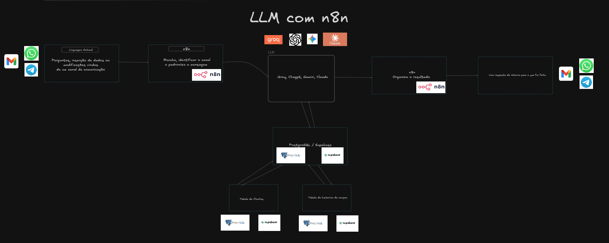
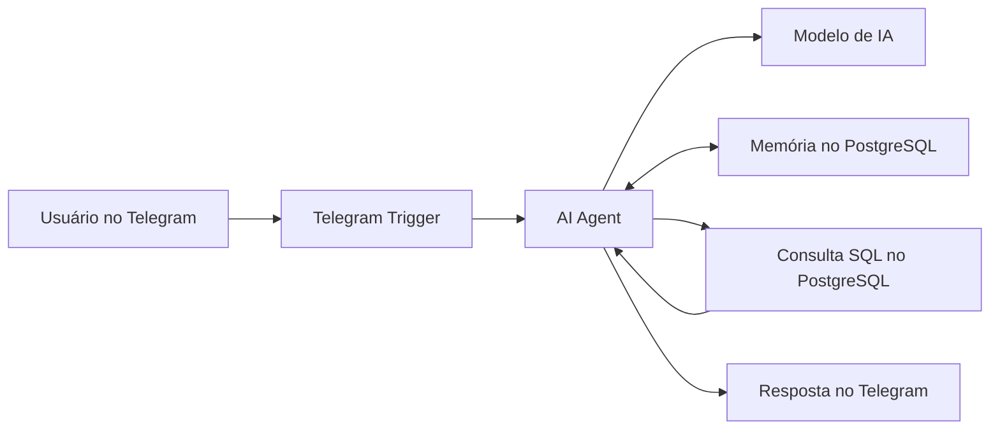

# Assistente Inteligente com n8n, Telegram e PostgreSQL

Assistente conversacional desenvolvido com **n8n** para receber perguntas pelo Telegram, interpretar solicitações em linguagem natural com um modelo de IA, consultar dados no PostgreSQL e devolver respostas organizadas ao usuário.

O projeto também utiliza memória de conversa armazenada no PostgreSQL, permitindo que o agente mantenha o contexto entre mensagens da mesma sessão.

## Visão geral

O usuário envia uma pergunta ao bot no Telegram. O n8n recebe a mensagem, encaminha o conteúdo ao AI Agent e disponibiliza uma ferramenta de consulta ao PostgreSQL. O agente cria uma consulta compatível com a solicitação, analisa o resultado e envia a resposta pelo próprio Telegram.

Exemplos de perguntas:

- Quais clientes estão cadastrados?
- Qual foi o consumo de determinado cliente?
- Organize os consumos por valor.
- Calcule o total consumido por cliente.
- Compare informações das tabelas de clientes e consumos.

## Resultado

O agente conseguiu consultar os registros, identificar clientes repetidos, calcular valores agregados e apresentar os dados de forma organizada diretamente no Telegram.



## Workflow no n8n

O fluxo implementado contém os seguintes nodes:

1. **Telegram Trigger** — recebe a mensagem enviada ao bot;
2. **AI Agent1** — interpreta a pergunta e coordena as ferramentas;
3. **OpenAI Chat Model** — processa a linguagem natural e gera a resposta;
4. **Postgres Chat Memory** — armazena o histórico da conversa por sessão;
5. **Execute a SQL query in Postgres** — executa a consulta solicitada pelo agente;
6. **Send a text message** — devolve o resultado no Telegram.



## Arquitetura





## Funcionamento

### 1. Recebimento da mensagem

O **Telegram Trigger** monitora novas mensagens enviadas ao bot e fornece ao workflow informações como texto, identificador do chat e dados do usuário.

### 2. Interpretação pelo AI Agent

O **AI Agent1** recebe a pergunta em linguagem natural e decide quando utilizar a ferramenta PostgreSQL. O agente não depende de comandos SQL escritos pelo usuário.

### 3. Consulta ao banco

A ferramenta **Execute a SQL query in Postgres** recebe do agente uma consulta gerada dinamicamente.

O workflow orienta o modelo a utilizar apenas consultas `SELECT`, permitindo leitura e análise dos dados sem modificar registros.

### 4. Memória de conversa

O **Postgres Chat Memory** utiliza o identificador do chat do Telegram como chave da sessão:

```text
{{ $('Telegram Trigger').item.json.message.chat.id.toString() }}
```

Assim, cada conversa mantém seu próprio histórico. A memória ajuda o agente a compreender referências como “esse cliente” ou “agora organize por valor”, mas não elimina o consumo de tokens: o histórico relevante ainda precisa ser enviado ao modelo.

### 5. Envio da resposta

Após interpretar o resultado da consulta, o agente produz uma resposta legível. O node **Send a text message** usa o mesmo `chat.id` para devolver a mensagem ao usuário correto.

## Tecnologias utilizadas

- [n8n](https://n8n.io/)
- Telegram Bot API
- OpenAI Chat Model
- PostgreSQL
- SQL
- AI Agent
- Memória conversacional
- JSON

## Estrutura do projeto

```text
Projeto_002/
├── Workflow/
│   └── Project_Agent000.json
├── imagens/
│   ├── excalidraw_project.png
│   ├── n8n_project.png
│   └── telegram_result.png
├── sql/
└── README.md
```

## Como utilizar

### Pré-requisitos

Antes de importar o workflow, é necessário ter:

- Uma instalação ou conta no n8n;
- Um bot criado pelo **BotFather** no Telegram;
- Uma credencial de modelo compatível no n8n;
- Um banco PostgreSQL acessível pelo n8n;
- Tabelas e dados de teste para consulta.

### Importação e configuração

1. Baixe o arquivo [`Project_Agent000.json`](Workflow/Project_Agent000.json);
2. No n8n, crie um workflow;
3. Selecione **Import from File**;
4. Importe o arquivo JSON;
5. Configure a credencial do Telegram;
6. Configure a credencial do modelo de IA;
7. Configure a conexão com o PostgreSQL;
8. Revise o prompt e os nomes das tabelas disponíveis;
9. Ative o workflow;
10. Envie uma mensagem ao bot pelo Telegram.

As credenciais não são incluídas no arquivo exportado. Cada usuário deve configurar seus próprios acessos depois da importação.

## Configuração das integrações

| Integração | Finalidade |
|---|---|
| Telegram | Receber perguntas e enviar respostas |
| OpenAI Chat Model | Interpretar solicitações e organizar resultados |
| PostgreSQL Tool | Consultar os dados |
| Postgres Chat Memory | Manter o histórico por conversa |
| n8n | Orquestrar todas as etapas |

## Segurança

Para reduzir riscos, recomenda-se:

- Criar um usuário PostgreSQL exclusivo para o agente;
- Conceder somente permissão de leitura;
- Liberar apenas as tabelas necessárias;
- Não armazenar tokens, senhas ou URLs privadas no repositório;
- Não utilizar dados pessoais ou de produção nas demonstrações;
- Definir limites de linhas e tempo de execução;
- Validar consultas antes de disponibilizar o projeto publicamente.

A instrução de usar apenas `SELECT` ajuda, mas a proteção principal deve existir nas permissões do próprio banco.

## Limitações atuais

- Respostas muito extensas podem ultrapassar o limite de mensagem do Telegram;
- Consultas grandes aumentam o consumo de tokens;
- O modelo pode criar uma consulta incorreta se não conhecer bem o esquema;
- A memória registra o histórico, mas pode aumentar o contexto enviado ao modelo;
- O projeto depende da disponibilidade das APIs e do banco.

## Possíveis melhorias

- Limitar resultados e implementar paginação;
- Exibir inicialmente um resumo e os dez primeiros registros;
- Criar uma ferramenta separada para cada domínio de dados;
- Adicionar tratamento de erros e tentativas de reprocessamento;
- Registrar métricas de execução, tempo e consumo;
- Restringir o acesso a usuários autorizados do Telegram;
- Implementar lista segura de tabelas e colunas;
- Criar comandos como `/ajuda`, `/resumo` e `/limpar_memoria`;
- Adicionar outros canais, como WhatsApp, Gmail ou Slack;
- Utilizar outros modelos compatíveis com o n8n.

## Aprendizados

Neste projeto foram aplicados conceitos de:

- Agentes de IA;
- Processamento de linguagem natural;
- Geração dinâmica de consultas SQL;
- Integração entre Telegram, n8n e PostgreSQL;
- Memória conversacional;
- Identificação de sessão por usuário;
- Automação orientada a eventos;
- Segurança de acesso a banco de dados;
- Organização e apresentação de resultados.

## Autor

**Henry Gabriel Santos Silva**

Estudante de Engenharia da Computação e desenvolvedor com foco em Engenharia de Dados, automação de processos e integração de sistemas.

- [LinkedIn](https://www.linkedin.com/in/henry-gabriel-santos-silva-6ba776209/)
- [GitHub](https://github.com/Henry-Gbriel)

## Licença

Este projeto está disponível sob a licença MIT.