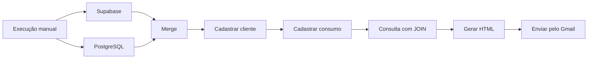

# Projetos de Automação com n8n

Repositório destinado ao desenvolvimento de projetos de automação utilizando o **n8n**, integrações com APIs, serviços em nuvem, bancos de dados e aplicações backend.

O objetivo é reunir automações que solucionam problemas reais, reduzem atividades manuais e demonstram diferentes possibilidades de integração entre sistemas.

## Sobre o repositório

Cada projeto está organizado em sua própria pasta e pode possuir:

- Workflow exportado do n8n;
- README com explicação detalhada;
- Imagens do funcionamento;
- Consultas SQL;
- Códigos JavaScript;
- Instruções para configuração;
- Tecnologias e integrações utilizadas;
- Problemas encontrados e suas soluções;
- Possíveis melhorias.

As automações deste repositório exploram conceitos como:

- Integração entre APIs;
- Automação de processos;
- Manipulação de dados JSON;
- Webhooks e formulários;
- Envio automatizado de e-mails;
- Integração com serviços do Google;
- Integração com Supabase;
- Consultas em PostgreSQL;
- Modelagem de bancos de dados;
- Mensageria;
- Aplicações backend;
- Tratamento de erros;
- Monitoramento de execuções;
- Sincronização de fluxos paralelos;
- Geração automática de relatórios.

## Projetos

| Projeto | Descrição | Integrações | Status |
|---|---|---|---|
| [Projeto 000 — Envio automatizado de documentos](Projeto_000/) | Recebe informações por formulário, registra os dados em uma planilha, baixa um documento do Google Drive, envia o arquivo por e-mail e atualiza o status do processamento. | n8n, Google Sheets, Google Drive e Gmail | Concluído |
| [Projeto 001 — Integração de clientes e consumos](Projeto_001/) | Consulta clientes e consumos, sincroniza diferentes fontes, relaciona dados com SQL e envia um relatório em HTML por e-mail. | n8n, Supabase, PostgreSQL, JavaScript e Gmail | Concluído |
| Projeto 002 | Em desenvolvimento | A definir | Planejado |

Esta tabela será atualizada conforme novos projetos forem desenvolvidos.

## Estrutura do repositório

```text
Projetos_automocao_n8n/
├── Projeto_000/
│   ├── images/
│   │   ├── formulario.png
│   │   └── workflow_completo.png
│   ├── Workflow/
│   │   └── Workflow Conexão.json
│   └── README.md
│
├── Projeto_001/
│   ├── code/
│   │   └── formatar_email.js
│   ├── images/
│   │   ├── workflow_completo.png
│   │   └── relatorio_email.png
│   ├── sql/
│   │   ├── criacao_base.sql
│   │   ├── node_new_client.sql
│   │   ├── node_new_consume.sql
│   │   └── relatorio_clientes_consumos.sql
│   ├── workflow/
│   │   └── workflow.json
│   └── README.md
│
├── LICENSE
└── README.md
```

Cada projeto é independente e contém a documentação necessária para entender, configurar e importar seu workflow.

## Projeto 000 — Envio automatizado de documentos

O primeiro projeto automatiza o envio de um documento a partir das informações fornecidas em um formulário.

O workflow executa as seguintes etapas:

1. Recebe os dados por um formulário do n8n;
2. Registra as informações no Google Sheets;
3. Baixa um documento armazenado no Google Drive;
4. Envia o documento por e-mail usando o Gmail;
5. Atualiza a planilha com o status `SENT`.

Entre os conceitos aplicados estão:

- Formulários do n8n;
- Integração com Google Sheets;
- Download de arquivos;
- Dados binários;
- Envio de anexos;
- Expressões do n8n;
- OAuth 2.0;
- Atualização de status.

A documentação completa está disponível na pasta:

[Ver Projeto 000](Projeto_000/)

## Projeto 001 — Integração de clientes e consumos

O segundo projeto realiza a integração de dados de clientes e consumos utilizando Supabase e PostgreSQL.

O workflow executa as seguintes etapas:

1. Consulta os clientes no Supabase;
2. Executa uma consulta no PostgreSQL;
3. Sincroniza as duas ramificações com o node Merge;
4. Cadastra ou atualiza o Cliente 101;
5. Registra um consumo relacionado ao cliente;
6. Relaciona as tabelas com um `INNER JOIN`;
7. Transforma os resultados em uma tabela HTML;
8. Envia um único relatório pelo Gmail.

A arquitetura do projeto é representada por:



Entre os conceitos aplicados estão:

- Integração entre Supabase e PostgreSQL;
- Modelagem relacional;
- Chaves primárias e estrangeiras;
- Consultas SQL;
- `INSERT`, `UPDATE` e `UPSERT`;
- Relacionamento com `INNER JOIN`;
- Sincronização de fluxos com Merge;
- Manipulação de múltiplos itens;
- JavaScript no n8n;
- Formatação de valores monetários;
- Geração de relatórios HTML;
- Envio automático de e-mails;
- Diagnóstico de execuções duplicadas.

O projeto também inclui:

- Script de criação da base;
- Geração de 100 clientes fictícios;
- Geração de consumos fictícios;
- Consultas utilizadas nos nodes;
- Código JavaScript do relatório;
- Imagens do workflow e do resultado;
- Workflow exportado em JSON.

A documentação completa está disponível na pasta:

[Ver Projeto 001](Projeto_001/)

## Como importar um workflow

1. Abra a pasta do projeto desejado;
2. Acesse a pasta `Workflow` ou `workflow`;
3. Faça o download do arquivo `.json`;
4. Abra o n8n;
5. Crie um novo workflow;
6. Selecione **Import from File**;
7. Escolha o arquivo JSON;
8. Configure suas próprias credenciais;
9. Ajuste tabelas, documentos, planilhas e demais recursos;
10. Revise os dados utilizados nos nodes;
11. Execute os testes;
12. Ative o workflow, se necessário.

## Tecnologias e serviços

As principais tecnologias utilizadas nos projetos incluem:

- [n8n](https://n8n.io/)
- [Supabase](https://supabase.com/)
- PostgreSQL
- APIs REST
- Webhooks
- Google Sheets
- Google Drive
- Gmail
- OAuth 2.0
- SQL
- JavaScript
- JSON
- HTML
- Python
- Bancos de dados
- Serviços em nuvem

As tecnologias podem variar de acordo com cada projeto.

## Segurança

Os workflows disponibilizados neste repositório não devem conter informações confidenciais.

Antes de publicar ou utilizar qualquer workflow, verifique se foram removidos:

- Senhas;
- Tokens de acesso;
- Chaves de API;
- Chaves do Supabase;
- Chave `service_role`;
- String de conexão do PostgreSQL;
- Client ID e Client Secret;
- Credenciais do n8n;
- Credenciais do Gmail;
- E-mails e telefones reais;
- Dados pessoais reais;
- IDs privados de arquivos e planilhas;
- URLs internas;
- Informações fixadas de execuções;
- Dados de produção.

Cada usuário deve configurar suas próprias credenciais depois de importar o workflow.

Os dados apresentados nos projetos são fictícios e utilizados exclusivamente para estudos.

## Objetivos

Este repositório foi criado com os objetivos de:

- Praticar automação de processos;
- Desenvolver integrações entre diferentes sistemas;
- Criar soluções aplicáveis a situações reais;
- Explorar recursos avançados do n8n;
- Praticar integração com bancos de dados;
- Trabalhar com processamento de dados;
- Documentar os aprendizados obtidos;
- Construir um portfólio técnico;
- Compartilhar conhecimento com a comunidade.

## Próximos passos

Entre as evoluções planejadas estão:

- Novas automações integradas com APIs;
- Projetos envolvendo aplicações backend;
- Integrações com bancos de dados;
- Processamento orientado a eventos;
- Uso de filas e mensageria;
- Implementação de idempotência;
- Tratamento centralizado de erros;
- Tentativas automáticas de reprocessamento;
- Notificações e monitoramento;
- Relatórios em CSV e Excel;
- Dashboards para acompanhamento;
- Automações com inteligência artificial;
- Deploy de serviços complementares em nuvem.

## Autor

**Henry Gabriel Santos Silva**

Estudante de Engenharia da Computação e desenvolvedor com foco em Engenharia de Dados, automação de processos e integração de sistemas.

- [LinkedIn](https://www.linkedin.com/in/henry-gabriel-santos-silva-6ba776209/)
- [GitHub](https://github.com/Henry-Gbriel)

## Licença

Este repositório está disponível sob a licença MIT. Consulte o arquivo [LICENSE](LICENSE) para mais informações.